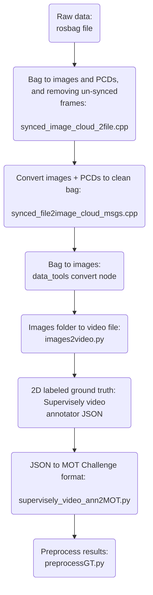
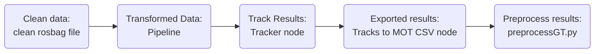
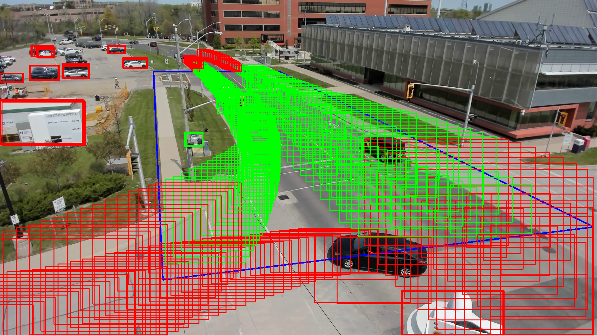

# Evaluation Scripts and Tools

## Description

These scripts help prepare the data for evaluation. We are using the HOTA metric and the supporting scripts from: https://github.com/JonathonLuiten/TrackEval/blob/master/scripts/run_mot_challenge.py.


### Ground Truth Data

Since we are using a custom dataset with rooftop traffic data, the basic workflow for obtaining the ground truth is presented below.

>Note: Since the rosbag data are not perfect, we also need to preprocess some of the un-syncronized frames that would otherwise cause an offset in the ground truth vs. tracker result.



### Tracker Data

For obtaining the tracker results:

---

## Preparing Data for Evalutation

### Background

The .txt files that contain fusion and tracker output from the ROS system require some prep before evaulating with metrics.
- HOTA requires frame numbers to start from 1.
- GT and Tracker data must have the same number of frames.

### Steps

1. **Re-number frames**
   - Re-number the frames starting from 1
   - Useful if you deleted some starting frames to keep the size the same (**see note below**)
2. **Preprocess detections**
   - Filter out detections that are not inside a region of interest

Use `preprocessGT.py`, you can set the ROI as a list of points that create a polygon and also view which detections are kept on a sample image. It will also re-number the frames automatically for you.

If you just want to re-number the frames without prerocessing you can run the `re_number_frames.py` script.

> **Note**: Larger detection netowrks have larger start up delays and may miss several of the starting image frames. To keep the same number of frames in GT and for each tracker, keep the last X frames that allow each tracker result to have the same number of frames. For example GT has frames 1-66, and tracker1 has frames 1-65 you can delete the frist 5 and 6 frames respectively.

**Example Output:** Red bboxes are removes, green are retained, and the blue outline is the RoI. <p align="center"></p>

---

### Evaluation

Clone the `TrackEval` repo and run the `run_mot_challenge.py` script to generate the results.

An example command for checking HOTA:

```
    python3 run_mot_challenge.py --USE_PARALLEL False --METRICS HOTA --GT_FOLDER /home/adrian/dev/metrics/Metrics/hota/gt/mot_challenge/  --TRACKERS_FOLDER /home/adrian/dev/metrics/Metrics/hota/trackers/mot_challenge  --DO_PREPROC False --BENCHMARK MOT20
```

The required folder struture for that example is:

```
    ├── kitti_MOT_2D_HOTA_Test
    │   ├── data
    │   │   ├── gt
    │   │   │   └── mot_challenge
    │   │   │       ├── MOT20-train
    │   │   │       │   └── MOT20-01
    │   │   │       │       ├── gt
    │   │   │       │       │   └── gt.txt ### From Sage GT
    │   │   │       │       └── seqinfo.ini
    │   │   │       └── seqmaps
    │   │   │           └── MOT20-train.txt
    │   │   └── trackers
    │   │       └── mot_challenge
    │   │           └── MOT20-train
    │   │               └── lidar2d   ### From obj_tracker/tracks2csv.py
```

Note: you can have multiple tracker results in the `tracker` folder.

With `seqinfo.ini`. Make sure the seqLength matches the number of frames you have in the GT and the Tracker Result. Image info is iirelavent for this test:
```
    [Sequence]
    name=MOT20-01
    imDir=img1
    frameRate=10
    seqLength=2
    imWidth=192000
    imHeight=100000
    imExt=.jpg
```
And `MOT20-train.txt`:

```
name
MOT20-01  ### Make sure this matches the GT folder.
```

---