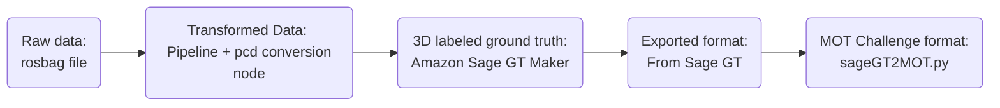
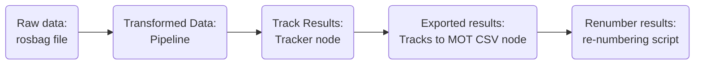

# Evaluation Scripts and Tools

## Description

These scripts help prepare the data for evaluation. We are using the HOTA metric and the supporting scripts from https://github.com/JonathonLuiten/TrackEval/blob/master/scripts/run_mot_challenge.py.

### Ground Truth Data

Since we are using a custom dataset with rooftop traffic data, the basic workflow for obtaining the ground truth is here:



### Tracker Data

For obtaining the tracker results:


## Evaluation

Clone the `TrackEval` repo and run the `run_mot_challenge.py` script to generate the results.

An example command for checking HOTA:
```
python3 run_mot_challenge.py --USE_PARALLEL False --METRICS HOTA --GT_FOLDER /home/adrian/dev/metrics/kitti_MOT_2D_HOTA_Test/data/gt/mot_challenge/  --TRACKERS_FOLDER /home/adrian/dev/metrics/kitti_MOT_2D_HOTA_Test/data/trackers/mot_challenge --DO_PREPROC False --BENCHMARK MOT20
```

The required folder struture for that example is:

```
    ├── kitti_MOT_2D_HOTA_Test
    │   ├── data
    │   │   ├── gt
    │   │   │   └── mot_challenge
    │   │   │       ├── MOT20-train
    │   │   │       │   └── MOT20-01
    │   │   │       │       ├── gt
    │   │   │       │       │   └── gt.txt ### From Sage GT
    │   │   │       │       └── seqinfo.ini
    │   │   │       └── seqmaps
    │   │   │           └── MOT20-train.txt
    │   │   └── trackers
    │   │       └── mot_challenge
    │   │           └── MOT20-train
    │   │               └── lidar2d   ### From obj_tracker/tracks2csv.py
```

Note: you can have multiple tracker results in the `tracker` folder.

With `seqinfo.ini`. Make sure the seqLength matches the number of frames you have in the GT and the Tracker Result. Image info is iirelavent for this test:
```
    [Sequence]
    name=MOT20-01
    imDir=img1
    frameRate=10
    seqLength=2
    imWidth=192000
    imHeight=100000
    imExt=.jpg
```
And `MOT20-train.txt`:

```
name
MOT20-01  ### Make sure this matches the GT folder.
```