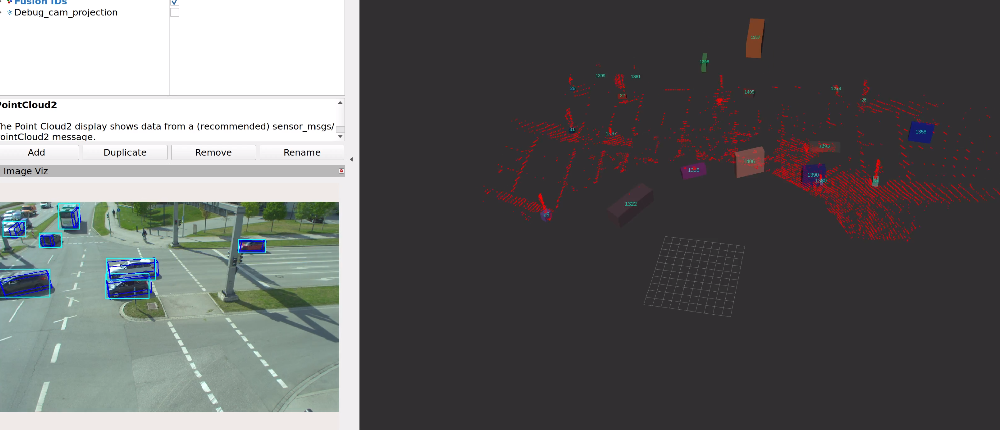
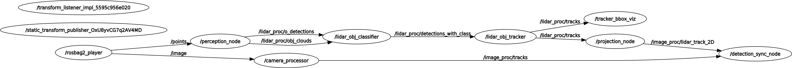

# cam_lidar_tools

This repositiory contains ROS 2 packages for realtime Camera-LiDAR Fusion for static roadside traffic monitoring applications.

>It is the implemetation as described in my thesis [A LIGHTWEIGHT CAMERA-LIDAR FUSION FRAMEWORK FOR TRAFFIC MONITORING APPLICATIONS](http://hdl.handle.net/11375/29905).

<p align="center">
        
</p>

---

## Directory

```
├── camera                          Camera Pipeline packages
│   ├── camera_det3d
│   └── camera_det2d
├── cam_lidar_bringup               System Bringup folder   **START HERE**
│   ├── configs
│   └── launch
├── data_tools                      Tools for converting and processing data
│   ├── data_tools
│   ├── launch
│   ├── scripts
│   └── src
├── Docs                            Additional information
│   ├── Archive
│   └── readme_images
├── drivers                         Hardware Drivers
│   ├── cam2image
    └── ouster_driver
├── fusion
│   ├── fusion_3d                   3D LiDAR + Camera Fusion module
│   └── fusion_2d                   2D LiDAR + Camera Fusion module
├── lidar
│   ├── learned_lidar_detector      Learned LiDAR Object Detection Module
│   ├── trad_lidar_detector              Traditional LiDAR Object Detection Module
│   ├── lidar_obj_classifier             LiDAR Object Classification Module
│   └── pipeline_interfaces         Custom interfaces for LiDAR modules
├── Metrics                         Evaluation scripts and information
│   ├── 2D_HOTA
│   ├── 2D_mAP
│   ├── 3D_F1
│   └── Archive
├── obj_tracker                     Object Tracking Module
│   ├── obj_tracker
│   ├── resource
│   └── test
└── ros2_numpy                      Tools for converting msgs to numpy (Submodule)
    ├── ros2_numpy
    └── test
```
<!---
tree -d -L 2 -I __pycache__
--->



---

# Install
Tested on:

| Ubunbtu 22 |
|:-------------:|
|  i7-11800H @ 2.30GHz × 16|
|   32 GB RAM   |
|  NVIDIA Quadro T1200 |
| CUDA Version: 11.8? - just let apt decide what it installs |

> If you prefer to use ROS 2 Galctic, a few changes in the code are required (vision_msgs/msg/Detection2D has a slightly different definition)

1. **ROS 2 Humble**: Follow https://docs.ros.org/en/humble/Installation/Ubuntu-Install-Debians.html.
2. Clone repo: 
    ```
    cd <ROS2_WS>/src
    git clone --recurse-submodules https://github.com/adrian-soch/cam_lidar_tools.git
    ```
3. Run rosdep tool to automatically download ROS dependencies `rosdep install --from-paths . -y --ignore-src`.
4. `sudo apt install nvidia-cudnn`
5. Python deps:
    ```
    pip3 install ros2-numpy==0.0.4 \
    transforms3d==0.4.1 \
    ultralytics==8.2.2 \
    open3d==0.18.0 \
    filterpy==1.4.5 \
    lap==0.4.0 \
    shapely>=2.0.4 \
    numpy==1.23.5
    ```

> Always source the ROS2 install and the local ros2 worksapce via `source /opt/ros/humble/setup.bash` and `. install/setup.bash` respectively.

---
# Running the code

1. Download the example ROS bags from: https://drive.google.com/drive/folders/1rVnvbeyFYvG2HnFULadnT8nWH69EnOCm?usp=sharing.
2. Update the folder path of the downloaded ROS bag [here](https://github.com/adrian-soch/cam_lidar_framework/blob/0f0b26503472e27e55a3fed84d4b8c8d708d0258/cam_lidar_bringup/launch/2d_fusion_demo.launch.py#L40) AND [here](https://github.com/adrian-soch/cam_lidar_framework/blob/0f0b26503472e27e55a3fed84d4b8c8d708d0258/cam_lidar_bringup/launch/3d_fusion_demo.launch.py#L14).

3. Run the launch file in the terminal `ros2 launch cam_lidar_bringup 2d_fusion_demo.launch.py` OR `ros2 launch cam_lidar_bringup 3d_fusion_demo.launch.py`. The primary launch file will start all the nodes including Rviz2 for visualization. The launch file has differnt bringup options for different demonstrations and output.

4. Tune parameters and re-run. inspect the launch file to see what nodes are being executed. Sometime the launch file calls other launch files. Each node may have different paramters that can be adjusted.

---
# Troubleshooting and Comments

## Colcon build fails?
- Check that the libraries you import are in your `CMakeLists.txt` (C++) or `setup.py` (Python) files.
- Certain warnings disappear if you build a 2nd time.
## Known issues

- 
